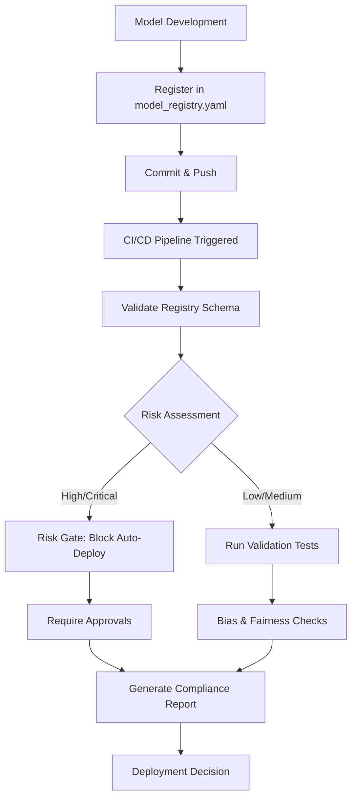

# AI Governance Starter Kit

[](https://opensource.org/licenses/MIT)
[](/.github/workflows/risk-gate.yml)
[](#sr-11-7-compliance)

> **Bridging Engineering Excellence and Risk Management for AI/ML Systems**

A comprehensive, production-ready framework for implementing **Governance-as-Code** for AI/ML models, aligned with **SR 11-7** (Supervisory Guidance on Model Risk Management) and modern DevOps practices.

## 🎯 Overview

The AI Governance Starter Kit enables organizations to:

- **Track and manage** all AI/ML models through a centralized registry
- **Enforce risk-based controls** via automated CI/CD gates
- **Validate code quality** with structural and logic auditing
- **Ensure compliance** with regulatory requirements (SR 11-7, GDPR, etc.)
- **Bridge the gap** between engineering teams and risk management

### What is Governance-as-Code?

**Governance-as-Code** applies Infrastructure-as-Code principles to AI governance:

```
Traditional Governance          →    Governance-as-Code
━━━━━━━━━━━━━━━━━━━━━━━━━━━━━━━━━━━━━━━━━━━━━━━━━━━━━━
Manual reviews                  →    Automated validation
Spreadsheet tracking            →    Version-controlled registry
Ad-hoc compliance checks        →    CI/CD-integrated gates
Siloed documentation           →    Executable policies
Reactive risk management       →    Proactive prevention
```

**Key Benefits:**
- ✅ **Automated** - Policies enforced automatically in every deployment
- ✅ **Auditable** - Complete history tracked in version control
- ✅ **Repeatable** - Consistent governance across all models
- ✅ **Scalable** - Supports hundreds of models without manual overhead
- ✅ **Collaborative** - Engineers and risk teams work from the same source of truth

## 📋 Repository Structure

```
ai_governance_starter_kit/
├── inventory/
│   └── model_registry.yaml          # Central model registry
├── .github/
│   └── workflows/
│       └── risk-gate.yml            # CI/CD risk gate workflow
├── validation/
│   └── structural/
│       └── code_scalpel_config.yaml # Code auditing configuration
├── docs/                            # Documentation (model cards, etc.)
├── models/                          # Model code and artifacts
└── README.md                        # This file
```

## 🚀 Quick Start

### 1. Model Registration

Register your AI/ML model in `inventory/model_registry.yaml`:

```yaml
models:
  - model_id: "your-model-id"
    name: "Your Model Name"
    version: "1.0.0"
    
    # Ownership
    owner:
      team: "Your Team"
      contact: "team@example.com"
      technical_lead: "lead@example.com"
    
    # Risk classification
    risk_tier: "medium"  # low, medium, high, critical
    
    # Model lineage
    lineage:
      training_data:
        - name: "training_dataset"
          version: "2024-Q1"
          source: "data-warehouse/path"
      framework: "scikit-learn"
      framework_version: "1.3.0"
```

### 2. CI/CD Integration

The risk gate workflow automatically runs on:
- Push to main/develop branches
- Pull requests modifying models or registry
- Manual workflow dispatch

```yaml
# .github/workflows/risk-gate.yml
on:
  push:
    paths:
      - 'models/**'
      - 'inventory/model_registry.yaml'
  pull_request:
    branches: [main, develop]
```

### 3. Code Validation

Configure code auditing rules in `validation/structural/code_scalpel_config.yaml`:

```yaml
analysis_rules:
  structural:
    - rule_id: "STR-001"
      name: "Model Class Structure"
      severity: "high"
      check:
        type: "pattern"
        pattern: "class.*Model.*:|def (fit|predict)\\("
```

## 📊 SR 11-7 Compliance

### What is SR 11-7?

**SR 11-7** (Supervisory Guidance on Model Risk Management) is regulatory guidance issued by the Federal Reserve and OCC that establishes standards for model risk management in financial institutions.

### Key Requirements

| SR 11-7 Requirement | Implementation in This Kit |
|---------------------|----------------------------|
| **Model Inventory** | `inventory/model_registry.yaml` tracks all models with metadata |
| **Risk Classification** | Risk tiers (low/medium/high/critical) with automated controls |
| **Model Validation** | Automated validation in CI/CD pipeline |
| **Documentation** | Model cards, technical docs, validation reports |
| **Ongoing Monitoring** | Performance tracking, drift detection, review schedules |
| **Governance Structure** | Approval workflows, stakeholder roles, escalation paths |

### Risk Tier Framework

```yaml
risk_tiers:
  critical:
    description: "Direct regulatory reporting or systemic risk"
    validation_frequency: "monthly"
    required_approvals: ["CRO", "Compliance", "Model Validation"]
    
  high:
    description: "Material impact on financial decisions"
    validation_frequency: "quarterly"
    required_approvals: ["Model Validation", "Compliance", "Business Owner"]
    
  medium:
    description: "Supporting decision-making tools"
    validation_frequency: "semi-annual"
    required_approvals: ["Technical Lead", "Model Validator"]
    
  low:
    description: "Minimal business impact"
    validation_frequency: "annual"
    required_approvals: ["Technical Lead"]
```

### Compliance Workflow



## 🔐 Security and Compliance Features

### Automated Checks

The risk gate workflow performs:

1. **Schema Validation** - Ensures all required fields are present
2. **Risk Assessment** - Classifies models by risk tier
3. **Documentation Check** - Verifies required documentation exists
4. **Bias Testing** - Confirms fairness testing was performed
5. **Code Quality** - Runs structural analysis on model code
6. **Deployment Gate** - Blocks high-risk deployments without approval

### Code Auditing Rules

The code scalpel configuration includes rules for:

- **Data Governance** - PII detection, data validation, retention policies
- **Logic Auditing** - Random seeds, error handling, hard-coded thresholds
- **Security** - SQL injection, pickle usage, credential detection
- **Fairness** - Protected attributes, fairness metrics, proxy variables

### Example: Risk Gate in Action

```bash
# Developer commits model changes
git add models/credit-risk-v2.py
git commit -m "Update credit risk model"
git push

# CI/CD pipeline runs automatically
✅ Validate Model Registry
✅ Risk Assessment
⚠️  HIGH-RISK MODEL DETECTED

🛑 DEPLOYMENT BLOCKED
High-risk models require additional approval:
- Model Validation Team
- Compliance Officer
- Risk Management

Required Documentation:
✓ Model card
✓ Validation report
✓ Risk assessment
⏳ Awaiting approval
```

## 📖 Detailed Documentation

### Model Registry Schema

The `model_registry.yaml` file tracks comprehensive metadata for each model:

```yaml
models:
  - model_id: "unique-identifier"
    name: "Human-readable name"
    version: "semver (e.g., 1.2.0)"
    
    owner:
      team: "Owning team name"
      contact: "Team email"
      technical_lead: "Lead engineer email"
      model_validator: "Validator email"
    
    risk_tier: "low|medium|high|critical"
    
    risk_assessment:
      date: "YYYY-MM-DD"
      reviewer: "Reviewer email"
      rationale: "Why this risk tier?"
      business_impact: "Description of impact"
      regulatory_scope: ["SR 11-7", "Other regulations"]
    
    lineage:
      training_data:
        - name: "Dataset name"
          version: "Dataset version"
          source: "Data source location"
          pii_flag: true|false
          retention_policy: "Duration"
      
      framework: "ML framework used"
      framework_version: "Framework version"
      dependencies: ["package==version"]
      
      training_pipeline:
        repository: "Git repo URL"
        commit_hash: "Git commit"
        trained_date: "YYYY-MM-DD"
    
    deployment:
      environment: "production|staging|dev"
      endpoint: "API endpoint URL"
      deployed_date: "YYYY-MM-DD"
      monitoring_dashboard: "Dashboard URL"
    
    validation:
      validation_date: "YYYY-MM-DD"
      validation_status: "approved|pending|rejected"
      test_coverage: "Percentage"
      performance_metrics:
        accuracy: 0.00
        precision: 0.00
        recall: 0.00
      
      bias_testing:
        performed: true|false
        protected_attributes: ["List of attributes"]
        fairness_metrics:
          demographic_parity: 0.00
    
    documentation:
      model_card: "Path to model card"
      technical_docs: "Path to tech docs"
      validation_report: "Path to validation report"
    
    monitoring:
      performance_monitoring: true|false
      drift_detection: true|false
      review_frequency: "monthly|quarterly|annual"
      next_review_date: "YYYY-MM-DD"
```

### CI/CD Pipeline Jobs

The `risk-gate.yml` workflow includes six jobs:

1. **validate-registry** - Validates YAML syntax and required fields
2. **risk-assessment** - Classifies models by risk tier
3. **model-validation** - Runs automated tests and checks
4. **risk-gate** - Blocks high-risk deployments
5. **compliance-report** - Generates governance reports
6. **notify** - Sends stakeholder notifications

### Code Scalpel Configuration

The code auditing tool checks for:

```yaml
# Example rules
analysis_rules:
  data_governance:
    - rule_id: "DATA-001"
      name: "PII Detection"
      severity: "critical"
      # Flags potential PII handling
  
  security:
    - rule_id: "SEC-003"
      name: "Credentials in Code"
      severity: "critical"
      # Blocks hard-coded credentials
  
  fairness:
    - rule_id: "FAIR-001"
      name: "Protected Attributes"
      severity: "high"
      # Flags use of sensitive attributes
```

## 🛠️ Customization

### Adding Custom Rules

Extend the code scalpel configuration:

```yaml
custom_rules:
  - rule_id: "CUSTOM-001"
    name: "Company-Specific Pattern"
    description: "Your custom check"
    severity: "medium"
    check:
      type: "pattern"
      pattern: "your_pattern_here"
```

### Adjusting Risk Thresholds

Modify risk tier definitions in `model_registry.yaml`:

```yaml
risk_tiers:
  custom_tier:
    description: "Your custom tier"
    validation_frequency: "your_frequency"
    required_approvals: ["Your approvers"]
```

### Integration with External Systems

The framework supports integration with:

- **ServiceNow** - Approval workflows
- **PagerDuty** - Incident notifications
- **Jira** - Issue tracking
- **Slack/Email** - Team notifications
- **Monitoring** - Datadog, Prometheus, etc.

## 🔄 Workflow Examples

### Example 1: Deploying a Low-Risk Model

```bash
# 1. Register model
vim inventory/model_registry.yaml
# Add model with risk_tier: "low"

# 2. Commit and push
git add inventory/model_registry.yaml
git commit -m "Register new recommendation model"
git push

# 3. CI/CD runs automatically
✅ Registry validated
✅ Risk: Low
✅ Validation passed
✅ Auto-deployed to staging
```

### Example 2: Deploying a High-Risk Model

```bash
# 1. Register model
vim inventory/model_registry.yaml
# Add model with risk_tier: "high"

# 2. Commit and push
git add inventory/model_registry.yaml
git commit -m "Register credit scoring model"
git push

# 3. CI/CD runs
✅ Registry validated
⚠️  Risk: High
✅ Validation passed
🛑 Deployment blocked - requires approval

# 4. Obtain approvals
# - Model Validation Team reviews
# - Compliance approves
# - Risk Management signs off

# 5. Manual deployment after approvals
# (with proper authorization)
```

## 🤝 Best Practices

1. **Keep Registry Updated** - Update `model_registry.yaml` for every model change
2. **Document Thoroughly** - Maintain model cards and technical documentation
3. **Test Before Deploying** - Run validation tests locally before pushing
4. **Review Risk Tiers** - Regularly reassess model risk classifications
5. **Monitor in Production** - Set up monitoring and alerting for deployed models
6. **Automate Everything** - Leverage CI/CD for consistent governance

## 📚 Additional Resources

- [SR 11-7 Full Text (Federal Reserve)](https://www.federalreserve.gov/supervisionreg/srletters/sr1107.htm)
- [Model Cards for Model Reporting](https://arxiv.org/abs/1810.03993)
- [Fairness Indicators](https://www.tensorflow.org/responsible_ai/fairness_indicators/guide)
- [MLOps Best Practices](https://ml-ops.org/)

## 🤔 FAQ

**Q: Do I need to use all components?**  
A: No, you can adopt incrementally. Start with the model registry, then add CI/CD gates, then code auditing.

**Q: Is this only for financial institutions?**  
A: No, while SR 11-7 is for financial services, the framework applies to any organization deploying AI/ML models.

**Q: How does this integrate with existing MLOps tools?**  
A: The framework is designed to complement tools like MLflow, Kubeflow, SageMaker, etc. Use the registry as your source of truth.

**Q: Can I use this for non-Python models?**  
A: Yes! The framework is language-agnostic. Customize the code scalpel config for R, Java, Scala, etc.

## 🧪 Testing

To test the framework:

```bash
# Validate registry YAML
python -c "import yaml; yaml.safe_load(open('inventory/model_registry.yaml'))"

# Run workflow locally (requires act)
act -j validate-registry

# Test code auditing rules
# (Implement your validation logic)
```

## 📄 License

MIT License - See LICENSE file for details.

## 🙏 Contributing

Contributions welcome! Please:

1. Fork the repository
2. Create a feature branch
3. Make your changes
4. Add tests if applicable
5. Submit a pull request

## 📞 Support

- **Issues**: [GitHub Issues](https://github.com/tescolopio/ai_governance_starter_kit/issues)
- **Discussions**: [GitHub Discussions](https://github.com/tescolopio/ai_governance_starter_kit/discussions)

---

**Built with ❤️ for bridging Engineering and Risk Management**
